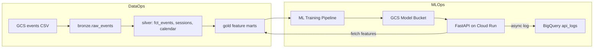

# E-commerce MLOps/DataOps Platform on GCP

End-to-end platform for e-commerce product demand forecasting, built on
Google Cloud Platform. The project covers three pillars:

1. **DataOps** — monthly batch data pipeline that ingests CSV event files
   from Cloud Storage into BigQuery, cleans and deduplicates them through
   a medallion architecture (Bronze → Silver → Gold) with Dataform, and
   produces feature marts consumed by ML training.
2. **ML** — a two-stage Hurdle Model (classifier + regressor) trained on
   gold-layer features to predict next-month product demand, tracked with
   MLflow.
3. **MLOps** — the trained model is uploaded to GCS, served via a FastAPI
   application containerized with Docker, deployed serverlessly on Cloud
   Run via Cloud Build, and every prediction is logged back to BigQuery
   for monitoring — closing the MLOps feedback loop.

Data source: `events.csv` (Oct 2020 – Feb 2021), e-commerce events
(view, cart, purchase).

## Stack

| Layer | Tech |
|-------|------|
| Storage of source CSVs | Google Cloud Storage |
| Warehouse | BigQuery |
| Transformations | Dataform (silver + gold) |
| Orchestration | Cloud Composer 2 / Airflow 2 |
| ML training | scikit-learn, XGBoost, MLflow |
| Model storage | Google Cloud Storage (decoupled from container) |
| Serving API | FastAPI + Uvicorn |
| Containerization | Docker |
| Deployment pipeline | Cloud Build → Artifact Registry → Cloud Run |
| Prediction monitoring | BigQuery (`mlops_monitoring.api_logs`) |
| Source of truth for code | This repository |

## Architecture



A single Composer DAG (`ecommerce_monthly`) runs once per calendar month:

1. waits for `gs://<bucket>/events/month=YYYY-MM/events_YYYY-MM.csv`
2. loads that file into the matching `_load_month` partition of
   `bronze.raw_events` (idempotent `DELETE` + `INSERT`)
3. compiles the Dataform repository with `load_month` and `snapshot_date`
   set as Dataform vars
4. invokes the workflow synchronously (silver, gold, assertions)

## Medallion model

### Bronze

`bronze.raw_events`

- One row per source CSV row, all columns as `STRING`
- Partitioned by `_load_month` (calendar month derived from the source file)
- Reloading a month replaces only that partition

| Column | Notes |
|--------|-------|
| `event_time_raw` ... `user_session_raw` | raw CSV values |
| `_source_uri` | GCS URI of the source file |
| `_ingested_at` | load timestamp |
| `_load_id` | tag of the load batch (Composer run id or manual marker) |
| `_load_month` | partition key, first day of the month |

### Silver

`silver.fct_events` (incremental, `uniqueKey: event_id`)

- Cleaned and typed events, deduplicated by natural key
  (`event_ts + event_type + product_id + user_id + user_session`)
- `event_id` is a SHA-256 of that natural key
- Only valid events: `event_type IN ('view', 'cart', 'purchase')`,
  non-null keys, non-negative price
- Partitioned by `event_date`, clustered by `user_id`, `product_id`,
  `user_session`
- `category_code` is also split into `category_l1` / `category_l2` /
  `category_l3` for downstream use

`silver.calendar_dates`

- Date dimension spanning the data range, used by `gold.dim_calendar`
- `month`, `week_of_year`, `day_of_week`, `is_weekend`,
  `days_to_end_of_month`

`silver.sessions`

- One row per `user_session`
- `session_start_ts`, `session_start_date`, plus the first event's
  `event_type`, `product_id`, `category_l1..l3`, `brand`, `price`
- Per-session counts of view / cart / purchase events

### Gold

`gold.dim_calendar`

- Calendar dimension republished from silver for gold consumers.

`gold.session_start`

- Features known at the first moment of a session (no snapshots).
- Joins `silver.sessions` with `silver.calendar_dates` to expose
  `hour_of_day` and `is_weekend` of the session start.

`gold.product_features_monthly` (incremental, partitioned by `snapshot_date`)

- One row per `(snapshot_date, product_id)`
- Aggregates over the **previous calendar month** before `snapshot_date`:
  `product_view_count_last_month`, `product_purchase_count_last_month`,
  `product_cart_count_last_month`, `product_conversion_rate_last_month`,
  `product_avg_price_last_month`, `product_unique_buyers_last_month`
- Latest known product attributes (no time window):
  `product_price`, `product_brand`,
  `product_category_l1 / l2 / l3` (taken from the latest event with a
  non-null `category_l1` so the three levels stay consistent)

`gold.user_features_monthly` (incremental, partitioned by `snapshot_date`)

- One row per `(snapshot_date, user_id)`
- Previous-calendar-month aggregates:
  `user_purchase_count_last_month`, `user_view_count_last_month`,
  `user_cart_count_last_month`, `user_conversion_rate_last_month`,
  `user_sessions_last_month`, `user_avg_price_purchased_last_month`,
  `user_cart_abandon_rate_last_month`
- `user_favorite_category_l1 / l2 / l3_last_month` — the most frequent
  `(l1, l2, l3)` tuple in the window (kept as one consistent tuple, not
  three independent modes)
- `user_favorite_brand_last_month`
- `days_since_last_purchase` — computed against the full history before
  `snapshot_date` (not the window)

`gold.user_product_interactions_monthly`
(incremental, partitioned by `snapshot_date`)

- One row per `(snapshot_date, user_id, product_id)`
- Previous-calendar-month counts: `ui_view_count_last_month`,
  `ui_cart_count_last_month`, `ui_purchase_count_last_month`,
  `ui_interaction_score_last_month`
- Recency from full history: `ui_days_since_last_view`,
  `ui_recency_score = EXP(-0.05 * days_since_last_view)`

### Quality assertions (`dataform_assertions.*`)

- `assert_events_primary_keys` — no nulls in PK columns of silver events
- `assert_valid_event_types` — only `view`, `cart`, `purchase`
- `assert_load_month_in_bronze` — at least one row was loaded for
  `load_month`
- `assert_snapshot_window` — `snapshot_date` is strictly after the latest
  event date

## Repository layout

```
data/                          - local monthly CSV files + split utility (gitignored)
sql/                           - one-time bootstrap and manual loader SQL
  00_create_datasets.sql       - create bronze/silver/gold/dataform_assertions
  01_create_bronze_raw_events.sql
  02_load_bronze_month.sql     - manual monthly load (DELETE + INSERT)
  03_create_monitoring_logs.sql - create mlops_monitoring.api_logs table
definitions/                   - Dataform models
  sources/bronze_raw_events.sqlx
  staging/stg_events.sqlx
  intermediate/int_calendar.sqlx, int_sessions.sqlx
  marts/dim_calendar.sqlx, session_start.sqlx,
        product_features_monthly.sqlx, user_features_monthly.sqlx,
        user_product_interactions_monthly.sqlx
  assertions/assert_*.sqlx
includes/constants.js          - shared JS variables for Dataform
workflow_settings.yaml         - Dataform project settings + default vars
config/monthly_loads.json      - manifest of all monthly loads
composer/                      - Cloud Composer DAG + helpers
  dags/ecommerce_monthly.py
  dags/sql/load_bronze_partition.sql
  variables_example.json
  requirements.txt
  README.md                    - Composer-specific setup
ml/                            - ML pipeline for product demand prediction
  src/data/bigquery_loader.py  - reads gold feature marts from BigQuery
  src/features/build_features.py
  src/split/snapshot_split.py
  src/models/                  - classifier, regressor and hurdle model code
  src/training/train_pipeline.py
  upload_model.py              - uploads trained .joblib to GCS
  requirements.txt
  README.md                    - ML-specific setup and run instructions
src/api/                       - production prediction API (MLOps)
  main.py                      - FastAPI app: serving, BQ feature fetch, monitoring
Dockerfile.serve               - container recipe for the serving API
cloudbuild.yaml                - 3-step deployment pipeline (build → push → deploy)
pyproject.toml                 - project dependencies
package.json                   - optional, for local Dataform CLI use
```

## One-time GCP setup

### DataOps infrastructure

1. **Enable APIs** in the target project: BigQuery, Cloud Storage,
   Dataform, Cloud Composer, Cloud Run, Cloud Build, Artifact Registry.
2. **Create datasets** by running `sql/00_create_datasets.sql` in the
   BigQuery console (creates `bronze`, `silver`, `gold`,
   `dataform_assertions` in `europe-central2`).
3. **Create the bronze table**: run `sql/01_create_bronze_raw_events.sql`.
4. **GCS bucket** for the monthly source files, e.g.
   `gs://ecommerce-bucket-csv-files`. Upload each file at
   `events/month=YYYY-MM/events_YYYY-MM.csv`.
5. **Dataform repository** in `europe-central2` connected to this Git
   repo. Set release configuration / branch to `main`.
6. **Composer environment** in `europe-central2`. Follow
   `composer/README.md` for permissions, Airflow variables and DAG
   upload.

### MLOps infrastructure

7. **Monitoring dataset**: create the `mlops_monitoring` dataset and
   `api_logs` table by running `sql/03_create_monitoring_logs.sql`.
8. **Artifact Registry repository**: create a Docker repository named
   `mlops-repo` in `europe-central2`:
   ```bash
   gcloud artifacts repositories create mlops-repo \
       --repository-format=docker \
       --location=europe-central2
   ```
9. **IAM permissions** for the default Compute Engine service account
   (used by Cloud Run):
   ```bash
   # Read features from BigQuery
   gcloud projects add-iam-policy-binding $PROJECT_ID \
       --member="serviceAccount:$PROJECT_NUMBER-compute@developer.gserviceaccount.com" \
       --role="roles/bigquery.user"
   gcloud projects add-iam-policy-binding $PROJECT_ID \
       --member="serviceAccount:$PROJECT_NUMBER-compute@developer.gserviceaccount.com" \
       --role="roles/bigquery.dataViewer"
   # Write prediction logs to BigQuery
   gcloud projects add-iam-policy-binding $PROJECT_ID \
       --member="serviceAccount:$PROJECT_NUMBER-compute@developer.gserviceaccount.com" \
       --role="roles/bigquery.dataEditor"
   # Download model from GCS
   gcloud projects add-iam-policy-binding $PROJECT_ID \
       --member="serviceAccount:$PROJECT_NUMBER-compute@developer.gserviceaccount.com" \
       --role="roles/storage.objectViewer"
   ```
10. **Cloud Build service account** needs Cloud Run Admin and
    Service Account User roles to deploy. See `cloudbuild.yaml` for
    details.

## Configuration

`workflow_settings.yaml` (used both by local Dataform CLI and as defaults
when no override is supplied):

```yaml
defaultProject: ecommerce-project-496110
defaultLocation: europe-central2
defaultDataset: silver
defaultAssertionDataset: dataform_assertions
vars:
  load_month: "2020-10"
  snapshot_date: "2020-11-01"
  bronze_dataset: bronze
  silver_dataset: silver
  gold_dataset: gold
```

The Composer DAG overrides `load_month` and `snapshot_date` per run via
the `code_compilation_config.vars` of the Dataform compilation result,
so the values in `workflow_settings.yaml` only matter for local /
console runs.

## How to run

### Option A: Cloud Composer (recommended)

Set up once (`composer/README.md`), then either let the monthly schedule
fire (1st day of each month at 05:00 UTC) or trigger the DAG manually
with config:

```json
{ "load_month": "2020-10" }
```

`snapshot_date` is derived automatically as the first day of the next
calendar month. To backfill the historical data, trigger the DAG once
for each `load_month` in `config/monthly_loads.json` - `max_active_runs=1`
serializes the runs.

### Option B: Manual run in the BigQuery + Dataform console

1. Upload `events_YYYY-MM.csv` to GCS at the expected path.
2. Run `sql/02_load_bronze_month.sql` after editing `load_month` and
   `gcs_uri`.
3. In Dataform: set `load_month` and `snapshot_date` in the development
   workspace (or override in the release config), compile, execute.

### Option C: Local Dataform CLI

Requires Node.js and `@dataform/core` (declared in `package.json`).

```bash
npm install
npx dataform compile
npx dataform run --dry-run
```

Authentication uses `gcloud auth application-default login`.

## Splitting the raw CSV into monthly files

`data/split_events_by_month.py` reads `data/events.csv` and writes one
`events_YYYY-MM.csv` per full calendar month. September 2020 is skipped
because the source data only starts on 2020-09-24.

```bash
python data/split_events_by_month.py
```

The output files are gitignored (`data/events*.csv` in `.gitignore`).

## Sanity checks after a run

```sql
-- bronze: one partition per loaded month
SELECT _load_month, COUNT(*) AS rows
FROM `ecommerce-project-496110.bronze.raw_events`
GROUP BY _load_month
ORDER BY _load_month;

-- silver: events scoped to processed months
SELECT FORMAT_DATE('%Y-%m', event_date) AS month, COUNT(*) AS rows
FROM `ecommerce-project-496110.silver.fct_events`
GROUP BY month
ORDER BY month;

-- gold: one snapshot per processed snapshot_date
SELECT snapshot_date, COUNT(*) AS products
FROM `ecommerce-project-496110.gold.product_features_monthly`
GROUP BY snapshot_date
ORDER BY snapshot_date;

-- every product seen as a session start must exist in product features
SELECT COUNT(*) AS orphan_products
FROM (
  SELECT DISTINCT first_product_id FROM `ecommerce-project-496110.gold.session_start`
  EXCEPT DISTINCT
  SELECT DISTINCT product_id      FROM `ecommerce-project-496110.gold.product_features_monthly`
);
-- should be 0 after backfilling all months
```

## Conventions

- Table-name suffix `_monthly` means "snapshotted once per calendar
  month, partitioned by `snapshot_date`".
- Tables without a time suffix (`dim_calendar`, `session_start`) are
  rebuilt on every run and do not snapshot.
- `_last_month` in column names refers to the previous calendar month
  (not a rolling 30-day window).
- All comments, descriptions and code identifiers are in English.

## Notes and caveats

- Calendar months have 28-31 days, so raw `*_count_last_month` values
  are not directly comparable across months. Downstream ML should
  normalize (e.g. per day) where appropriate.
- The pipeline assumes one source file per month. Late-arriving events
  for a previous month must be folded into that month's CSV before
  re-running the DAG for that `load_month`; the DELETE + INSERT pattern
  makes that safe.
- `silver.fct_events` uses `event_id = SHA256(natural_key)` and dedups
  with `QUALIFY ROW_NUMBER() OVER (...) = 1`. Identical events from
  retries collapse to a single row.

---

## MLOps: Model Serving & Monitoring

This section documents the production serving layer that takes the
trained model and makes it available as an API.

### Prediction API

`src/api/main.py` implements a FastAPI application with two endpoints:

- **`POST /predict/demand`** — accepts a product prediction request and
  returns a demand forecast
- **`GET /health`** — returns `{"status": "ok"}` for liveness checks

The prediction flow for `/predict/demand`:

1. **Receive request** — validates input via Pydantic
   (`product_id`, `brand`, `category`, `price`, `prev_month_sales`)
2. **Fetch features from BigQuery** — queries
   `gold.product_features_monthly` joined with `gold.dim_calendar` to
   retrieve the latest engineered features for the given `product_id`
3. **Reconstruct feature vector** — applies the same feature engineering
   as the training pipeline (derived features like `price_delta`,
   `view_to_cart_rate`, `cart_to_purchase_rate`, one-hot encoded
   categories) and aligns columns to the model's `feature_names` list
   to prevent training-serving skew
4. **Run Hurdle Model** — passes the feature vector through the
   two-stage model (classifier × regressor) and returns the prediction
5. **Async log** — logs the prediction, full request payload, and model
   version to `mlops_monitoring.api_logs` in the background

**Graceful fallback:** if BigQuery features are unavailable or the model
fails to load, the API returns a heuristic prediction based on
`prev_month_sales` with `model_version: "mock-v1"`. The API never
returns a 500 error.

### Decoupled model storage

The model artifact (`.joblib`) is stored in Google Cloud Storage
(`gs://<project>-models/demand_forecast_model.joblib`), **not** inside
the Docker container. At container startup, the API downloads the latest
model from GCS.

This decoupled architecture means a new model can be deployed by:
1. Running `ml/upload_model.py` to upload the new `.joblib` to GCS
2. Restarting the Cloud Run service

No container rebuild is required — saving 5-10 minutes per model update.

### Deployment pipeline

`cloudbuild.yaml` defines a 3-step pipeline triggered manually via
`gcloud builds submit --config=cloudbuild.yaml`:

| Step | What it does |
|------|--------------|
| 1. Build | Builds a Docker image from `Dockerfile.serve` |
| 2. Push | Pushes the image to Artifact Registry (`mlops-repo`) |
| 3. Deploy | Deploys the image to Cloud Run (`demand-forecast-api`) |

The container includes Python 3.11, all dependencies, the API code
(`src/api/`), and the model class definition (`ml/src/models/`) needed
to deserialize the `.joblib` file. The model weights themselves are
fetched from GCS at runtime.

### Monitoring feedback loop

Every prediction is logged asynchronously to
`mlops_monitoring.api_logs` (created by `sql/03_create_monitoring_logs.sql`):

| Column | Description |
|--------|-------------|
| `timestamp` | UTC time of the prediction request |
| `user_id` | Product ID (mapped to `user_id` column) |
| `session_id` | Batch identifier (default: `monthly_forecast_run`) |
| `request_payload` | Full input payload as JSON |
| `prediction_score` | Predicted demand quantity |
| `model_version` | `hurdle-xgb-v1` (real) or `mock-v1` (fallback) |

This closes the MLOps feedback loop: training data lives in BigQuery
(gold layer), the model trains on that data, and production predictions
flow back into BigQuery — enabling downstream drift detection and
retraining triggers.

### How to run the serving stack

1. **Train the model** (from the `ml/` directory):
   ```bash
   python -m src.training.train_pipeline
   ```
2. **Upload model to GCS**:
   ```bash
   python upload_model.py
   ```
3. **Build and deploy**:
   ```bash
   gcloud builds submit --config=cloudbuild.yaml
   ```
4. **Test the API**:
   ```bash
   # Health check
   curl https://<CLOUD_RUN_URL>/health

   # Real prediction (product exists in BigQuery)
   curl -X POST https://<CLOUD_RUN_URL>/predict/demand \
     -H "Content-Type: application/json" \
     -d '{"product_id": "4183880", "brand": "samsung", "category": "electronics", "price": 44.21, "prev_month_sales": 15}'

   # Fallback prediction (product does not exist)
   curl -X POST https://<CLOUD_RUN_URL>/predict/demand \
     -H "Content-Type: application/json" \
     -d '{"product_id": "99999999", "brand": "test", "category": "test", "price": 10.0, "prev_month_sales": 5}'
   ```
5. **Verify monitoring**:
   ```sql
   SELECT timestamp, user_id AS product_id, prediction_score, model_version
   FROM `ecommerce-project-496110.mlops_monitoring.api_logs`
   ORDER BY timestamp DESC
   LIMIT 5;
   ```
